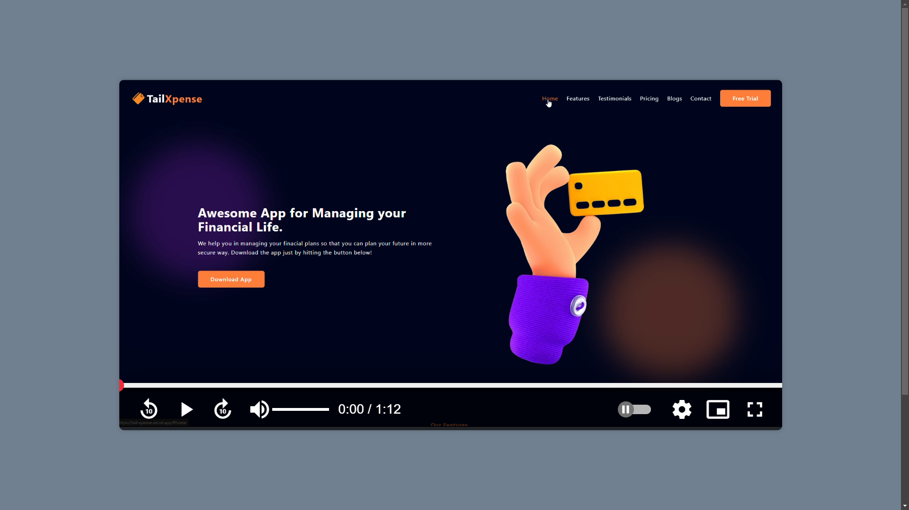

# BuzzPlay: Ansrsource Task 02

<em> An assessment task from Ansrsource for Internship role. Thanks for providing the opportunity to showcase my skills </em>

## Table of Contents 🧾

- [Overview](#overview)
- [Features](#features)
- [Tech Stack](#tech-stack)
- [Live Demo](#live-demo)
- [Getting Started](#getting-started)
  - [Prerequisites](#prerequisites)
  - [Installation](#installation)
- [License](#license)
- [Author](#author)

## Overview

BuzzPlay is a cutting-edge custom video player that enhances your viewing experience with its sleek design using HTML, CSS, and Javascript. Enjoy complete control with features like adjustable playback speed, personalized pause settings, and precise volume management, making it the perfect choice for anyone who values customization and quality in video playback.

## Features

- **Responsive Design**
- **Custom Play Pause Button**
- **Custom Volume Control**
- **Custom PlayBack Settings**
- **Custom Progress Bar**
- **Picture in Picture**


## Tech Stack

- **HTML:** Semantic markup for content structure and accessibility with Consistent selector naming.
- **CSS:** Responsive styling, smooth transitions, and visual design by using different selectors/pseudo selectors and extracting the constants as CSS variables.
- **JavaScript:** Enhances interactivity by leveraging the DOM manipulation with suitable selectors and attributes with well commented code.
- **Google Icon:** Used the google material icon to get the web optimized icons.

## Preview


## Live Demo

[BuzzPlay](https://buzz-play-by-me.vercel.app/) Live on Vercel 🟢

## Getting Started

Follow these steps to set up the project locally.

### Prerequisites

Make sure you have the following installed:

- [Git](https://git-scm.com/)
- A code editor like [VS Code](https://code.visualstudio.com/)

### Installation

1. **Clone the repository:**

   ```bash
   git clone https://github.com/thesakshijaiswal/Ansrsource-Task-1.git
   ```

2. **Navigate to the project directory:**

   ```bash
   cd Ansrsource-Task-1
   ```

3. **Navigate to the project directory:**

   ```bash
   code .
   ```

4. **Use Live server:**

   Use live server extension in VS code to run the local server of index.html file in your favorite browser

   **Or Simple Zip Download**

   `just download as zip, extract and open the index.html file in your favorite browser`

## License

This project is licensed under the MIT License. See the [LICENSE](LICENSE) file for more details.

## Author

Name: Sakshi Jaiswal

LinkedIn: [thesakshijaiswal](https://www.linkedin.com/in/thesakshijaiswal)

GitHub: [thesakshijaiswal](https://github.com/thesakshijaiswal)

### _Please give my the Repository a star ⭐ if you like my work 😊_
